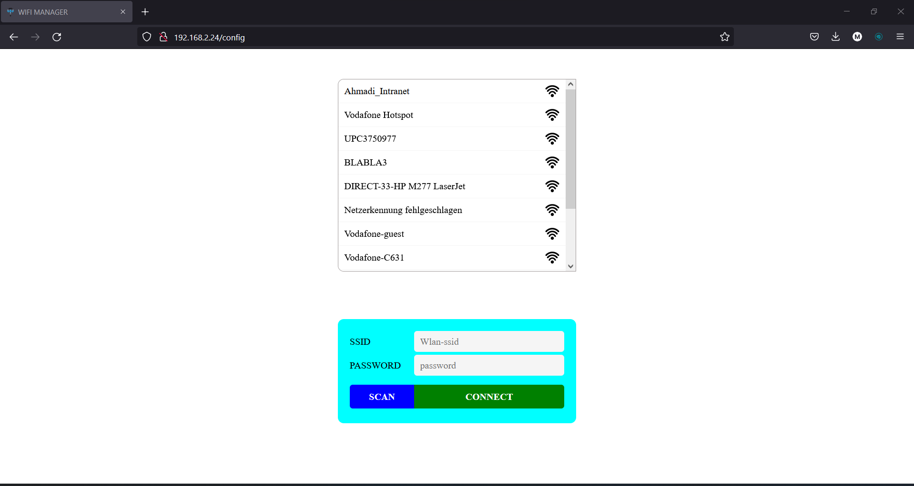
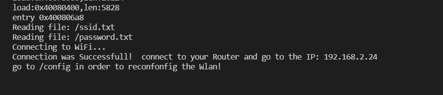

# wifi_manager_with_expressjs
wifi_manager for esp32 with a expressjs backend server

It just a basic template esp32 wifi manager for creating a Access point and after that to connect the esp32 to the giving ssid and password!

#### partion in esp32
in esp32 we could upload files to the **SPIFFS**.
in order to do it we should create a folder with the name __data__
after creating the folder we could add our files inside it and upload it to the ESP32 SPIFFS using
[platformio](https://docs.platformio.org/en/latest/). [click here](https://docs.platformio.org/en/latest/)
or
#### [Arduino](https://www.arduino.cc/en/software)
for _Arduino_ you have to donwload the Tool from [ZIP](https://github.com/me-no-dev/arduino-esp32fs-plugin/releases/tag/1.0) 
and follow the Steps in [page](https://github.com/me-no-dev/arduino-esp32fs-plugin).

#### usages
clone this repository and connect your ESP32 with USB!
after creating the Partion and uploading the folder data to the SPIFFS build the Project and connect to to the Acces point WIFI called ESP32 in order to configurate the ESP32 with your own

